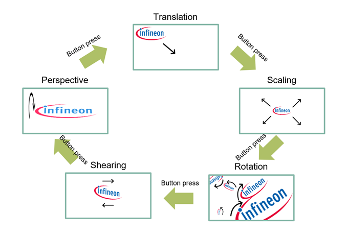
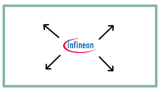
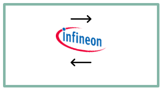
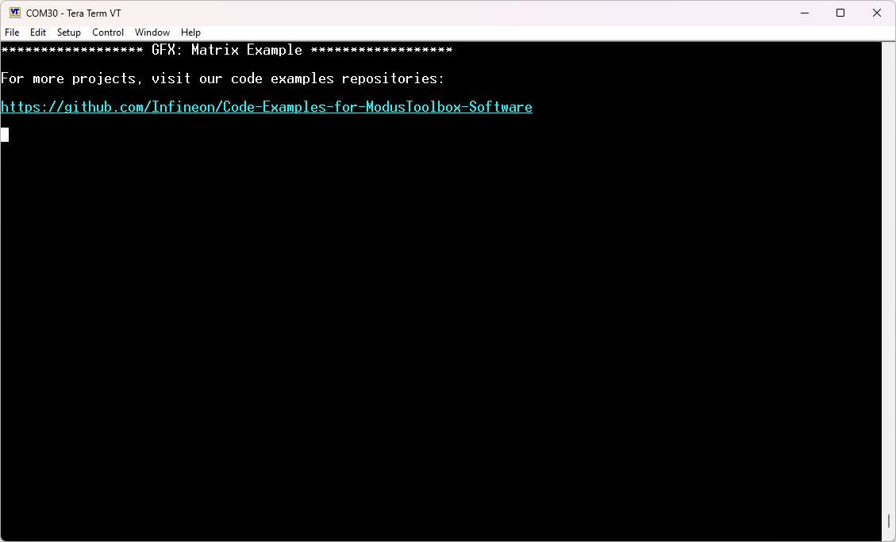
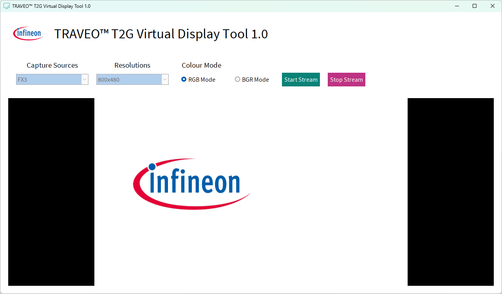

# Graphics Matrix for graphics middleware

**This code example shows how to utilize matrices to achieve linear, affine and perspective transformations. This allows to have various effects achieved at runtime without prerendering the content.**

The drivers used or available in this code example are listed below.
- [Graphics Driver for TRAVEO™ T2G cluster series user guide](https://myicp.infineon.com/sites/TRAVEODocumentation/Lists/defaultdoclib/Forms/AllItems.aspx?RootFolder=%2Fsites%2FTRAVEODocumentation%2FLists%2Fdefaultdoclib%2FTraveo%20II%2FTraveo%20II%20Cluster%2FGraphics&FolderCTID=0x01200023F2B2CA20D58647B6BFDE768454209B&View=%7BC8DBE6BD%2D4E7B%2D49A9%2D9267%2D2F926C13CB27%7D)
  - Chpater 4: Modules
  - Chapter 5: Classes
> **Note:** The above document are available on the myInfineon Collaboration Platform (MyICP). If not already available, please create a myInfineon account on [www.infineon.com](http://www.infineon.com/). Then, contact traveo@infineon.com and request access to TRAVEO™ T2G myICP.


- [JPEG decode driver user guide (TRAVEO™ T2G cluster series)](https://www.infineon.com/assets/row/public/documents/10/44/infineon-traveo-t2g-jpeg-decode-user-guide-usermanual-en.pdf?fileId=8ac78c8c8c3de074018c816028cf0ca8)
  - Chapter 2: JPEG decode driver

## Requirements

- [ModusToolbox&trade;](https://www.infineon.com/modustoolbox) v3.5 or later (tested with v3.5)
- This code example uses [TRAVEO&trade; T2G Virtual Display Tool](https://softwaretools-preview.icp.infineon.com/tools/com.ifx.tb.tool.traveot2gvirtualdisplaytool) to output image. This Tool is available only on Windows.

## Supported toolchains (make variable 'TOOLCHAIN')

- GNU Arm&reg; Embedded Compiler v11.3.1 (`GCC_ARM`) – Default value of `TOOLCHAIN`

## Device

The device used in this code example (CE) is:
- [TRAVEO™ T2G CYT4DN Series](https://www.infineon.com/products/microcontroller/32-bit-traveo-t2g-arm-cortex/for-cluster/t2g-cyt4dn)

## Board

The board used for testing is:
- TRAVEO™ T2G Cluster 6M Lite Kit ([KIT_T2G_C-2D-6M_LITE](https://www.infineon.com/cms/en/product/evaluation-boards/kit_t2g_c-2d-6m_lite/))

## Scope of work

This code example demonstrates how to achieve transformations with matrices which include translation, scaling, rotation, shearing and perspective (3D-like effect). This allows to have dynamic animations with high framerate at runtime without prerendering the content, thus requiring low amount of memory.

## Introduction

**Mathematical background**

Transformation with matrices can be categorized into:
- Linear
- Affine
- Perspective

The category for each transformation used in this CE is as follow:

- **Translation**: Affine
- **Scaling**: Linear
- **Rotation**: Linear
- **Shearing**: Linear
- **Perspective**: Perspective

Normally, a matrix is equivalent to a linear transformation. By using homogenous coordinates (increasing number of dimensions), affine and perspective transformations are possible. Since we are working with two-dimensional images, we need to use three- to four-dimensional matrices for affine and perspective transformations.

To ease the use of these, most common transformations are included in the utility library and are extensively used in this code example. The shearing transformation shows how to manually apply a matrix.

Transformations can be concatenated by multiplying matrices. The order of multiplication is highly important because matrix-multiplications are not commutative.


**Matrices on T2G**

A matrix can be applied directly on the blit engine or on a window. Latter restricts and limits the use of some matrices; for example, perspective transformations are not possible on a window.

*Note: The allowed matrix properties on a window depend on the applied window features. For example, to allow scaling on a window with a factor of 10, the feature CYGFX_DISP_FEATURE_UPSCALE is required.*

In the CE, everything is applied via the blit engine.

Functions to use:

```c
CYGFX_ERROR CyGfx_BeSetGeoMatrix(CYGFX_BE_CONTEXT beCtx, CYGFX_BE_TARGET target, CYGFX_BE_GEO_MATRIX_FORMAT format, const CYGFX_FLOAT* fMatrix)

CYGFX_ERROR CyGfx_WinSetGeoMatrix(CYGFX_WINDOW win, CYGFX_U32 target, const CYGFX_FLOAT* matrix)
```

More details can be found in:
- TRAVEO&trade; T2G CYT4DN
    - [Technical Reference Manual (TRM)](https://www.infineon.com/products/microcontroller/32-bit-traveo-t2g-arm-cortex/for-cluster/t2g-cyt4dn#documents)
    - [Registers TRM](https://www.infineon.com/products/microcontroller/32-bit-traveo-t2g-arm-cortex/for-cluster/t2g-cyt4dn#documents)
    - [Data Sheet](https://www.infineon.com/products/microcontroller/32-bit-traveo-t2g-arm-cortex/for-cluster/t2g-cyt4dn#documents)

## Hardware setup

This CE has been developed for:
- TRAVEO™ T2G Cluster 6M Lite Kit ([KIT_T2G_C-2D-6M_LITE](https://www.infineon.com/cms/en/product/evaluation-boards/kit_t2g_c-2d-6m_lite/))

*Figure 1. KIT_T2G_C-2D-6M_LITE (Top View)*


No changes are required from the board's default settings.

## Implementation

**STDOUT/STDIN setting**

UART is initialized to print information if an error happens.

Initialization of the GPIO for UART is done in the <a href="https://infineon.github.io/retarget-io/html/group__group__board__libs.html#gaddff65f18135a8491811ee3886e69707"><i>cy_retarget_io_init()</i></a> function.
- Initializes the pin specified by *CYBSP_DEBUG_UART_TX* as UART TX and the pin specified by *CYBSP_DEBUG_UART_RX* as UART RX (these pins are connected to KitProg3 COM port)
- The serial port parameters are 8N1 and 115200 baud

**Mode of Operation**

The code example shows the visual output of matrices applied to the Infineon logo. By pressing *User Button1 (S900)* the scene can be changed. See following figure for all available scenes:

<p align="center"><i>Figure 2. Mode of operation</i></p>
<p align="center">

</p>

Following sections describe each scene in more detail by providing matrix, code snippet and an explanation.

**Translation**

<p align="center"><i>Figure 3. Translation visual</i></p>
<p align="center">

</p>

<p align="center">

</p>

```c
transX += velX;
transY += velY;
utMat3x2LoadIdentity(matTrans);
utMat3x2Translate(matTrans, transX, transY);
CyGfx_BeBindSurface(ctx, CYGFX_BE_TARGET_SRC, surfIfx);
CyGfx_BeSetGeoMatrix(ctx, CYGFX_BE_TARGET_SRC, CYGFX_BE_GEO_MATRIX_FORMAT_3X2, matTrans);
CyGfx_BeBlt(ctx, 0.f, 0.f);
```

In each frame the translation gets updated (collision detection is omitted in code listing). The declared Mat3x2 matrix gets initialized with **utMat3x2LoadIdentity()**. Afterwards, the translate utility function is called. To apply the matrix, we bind our desired surface and then set the matrix. **CyGfx_BeBlt()** executes an blit operation.

**Scaling**

<p align="center"><i>Figure 4. Scaling visual</i></p>
<p align="center">

</p>

<p align="center">

</p>

```c
CYGFX_FLOAT translateX = (CYGFX_FLOAT) WINDOW_WIDTH/2.f - scaleX*utSurfWidth(surfIfx)/2.f;
CYGFX_FLOAT translateY = (CYGFX_FLOAT) WINDOW_HEIGHT/2.f - scaleY*utSurfHeight(surfIfx)/2.f;
utMat3x2LoadIdentity(matScale);
utMat3x2Translate(matScale, translateX, translateY);
utMat3x2Scale(matScale, scaleX, scaleY);
CyGfx_BeBindSurface(ctx, CYGFX_BE_TARGET_SRC, surfIfx);
CyGfx_BeSetGeoMatrix(ctx, CYGFX_BE_TARGET_SRC, CYGFX_BE_GEO_MATRIX_FORMAT_3X2, matScale);
CyGfx_BeBlt(ctx, 0.f, 0.f);
```

Here, the surface gets moved to the center. If matrices are multiplied, the last multiplication is applied first (thus read multiplications from bottom to top). Scale has to be applied first, since the scaling is done relative to the origin of the screen (top-left corner).

**Rotation**

<p align="center"><i>Figure 5. Rotation visual</i></p>
<p align="center">

</p>

<p align="center">

</p>


```c
rotations[i] += VEL_ROT[i];
utMat3x2LoadIdentity(matRotate[i]);
utMat3x2Translate(matRotate[i], POS[2*i], POS[2*i+1]);
utMat3x2Rot(matRotate[i], rotations[i]);
utMat3x2Translate(matRotate[i], -SCALES[i]*utSurfWidth(surfIfx)/2.f, -SCALES[i]*utSurfHeight(surfIfx)/2.f);
utMat3x2Scale(matRotate[i], SCALES[i], SCALES[i]);
CyGfx_BeSetGeoMatrix(ctx, CYGFX_BE_TARGET_SRC, CYGFX_BE_GEO_MATRIX_FORMAT_3X2, matRotate[i]);
CyGfx_BeBlt(ctx, 0.f, 0.f);
```

This code gets executed in a loop five times (for five logos). Only thing to pay attention to here is the order of multiplications to achieve the end result.

**Shearing**

<p align="center"><i>Figure 6. Shearing visual</i></p>
<p align="center">

</p>

<p align="center">

</p>

```c
Mat3x2 mat_shear = 
{
   1.f, shearY, shearX,
   1.f, 0.f, 0.f
};
CyGfx_BeBindSurface(ctx, CYGFX_BE_TARGET_SRC, surfIfx);
CyGfx_BeSetGeoMatrix(ctx, CYGFX_BE_TARGET_SRC, CYGFX_BE_GEO_MATRIX_FORMAT_3X2, mat_shear);
CyGfx_BeBlt(ctx, WINDOW_WIDTH/2.f - utSurfWidth(surfIfx)/2.f, WINDOW_HEIGHT/2.f - utSurfHeight(surfIfx)/2.f);
```

This code creates a matrix manually. Matrices are arrays in column-major order. The exact layout of a shear matrix can be looked up online.

*Remark: Instead of translating the surface via matrix, we just change the values of the blit offset in CyGfx_BeBlt().*

**Perspective**

<p align="center"><i>Figure 7. Perspective visual</i></p>
<p align="center">

</p>

<p align="center">

</p>

```c
/* Calculate view matrix, which will prepare translation and shifting for perspective */
utMat4x4LoadIdentity(matView);
utMat4x4Translate(matView, -1.f, -1.f, 0.f);
utMat4x4Scale(matView, 2.f / utSurfWidth(surfIfx), 2.f / utSurfHeight(surfIfx), 1.f);

/* Do something dynamic on object, in this case rotate it */
utMat4x4LoadIdentity(matRotation);
utMat4x4RotX(matRotation, rotation);

/* Calculate projection matrix, which will generate perspective */
utMat4x4LoadIdentity(matProjection);
utMat4x4Perspective(matProjection, FOV, ASPECT, NEAR_PLANE, FAR_PLANE);
utMat4x4Translate(matProjection, 0.f, 0.f, -6.f);

/* Calculate viewport matrix, which will put the object back to the screen (after perspective) */
utMat4x4LoadIdentity(matViewport);
utMat4x4Translate(matViewport, WINDOW_WIDTH/2.f, WINDOW_HEIGHT/2.f, 0.f);
utMat4x4Scale(matViewport, 1.5f*utSurfWidth(surfIfx), 1.5f*utSurfHeight(surfIfx), 1.f);

/* Combine all matrices (pay attention to correct order of multiplications!) */
utMat4x4LoadIdentity(matFinal);
utMat4x4Multiply(matFinal, matFinal, matViewport);
utMat4x4Multiply(matFinal, matFinal, matProjection);
utMat4x4Multiply(matFinal, matFinal, matRotation);
utMat4x4Multiply(matFinal, matFinal, matView);

/* Transform to 3x3 matrix (perspective divide) */
Mat3x3 matApply;
utMat4x4ToMat3x3(matFinal, matApply);
CyGfx_BeBindSurface(ctx, CYGFX_BE_TARGET_SRC, surfIfx);
CyGfx_BeSetGeoMatrix(ctx, CYGFX_BE_TARGET_SRC, CYGFX_BE_GEO_MATRIX_FORMAT_3X3, matApply);
CyGfx_BeBlt(ctx, 0.f, 0.f);
```

Perspective transformation is more involved by utilizing 4x4 matrices. The example was created by generating a so-called view and projection matrix. This nomenclature is standard in the field of shading languages (OpenGL, DirectX, etc.). To gain a better understanding, many sources can be consulted and found by searching for the term “Model View Projection Matrices”.

In the end, the 4x4 matrix has to be transformed into a 3x3 matrix. This is done by the function **utMat4x4ToMat3x3()**.

*Remark: All but the rotation matrix can be precomputed and don't have to be calculated each frame.*

## Run and Test

For this code example, a terminal emulator is required for displaying debug outputs. Install a terminal emulator if you do not have one. Instructions in this document use [Tera Term](https://teratermproject.github.io/index-en.html).

You need to download [TRAVEO™ T2G Virtual Display Tool](https://softwaretools-preview.icp.infineon.com/tools/com.ifx.tb.tool.traveot2gvirtualdisplaytool) in advance. The graphics example uses the FX3 controller to display the content via USB.

After code compilation, perform the following steps for flashing the device:
1. **Power and Connection Setup:**
   - Connect USB 3.0 Type-C cable between KitProg3 connector (X400) and PC USB port
   - Connect USB 3.0 Type-C cable between EZ-USB™ FX3 connector (X500) and PC USB port
      - *Note: one USB connection is sufficient when it is not required to observe the UART output at the same time as the display. For flashing, debugging and UART, use the KitProg3 connector (X400). For display output, use the EZ-USB™ FX3 connector (X500).*
   - Verify power LEDs are illuminated (D400, D104, D102, D103)

2. **UART output Setup:**
   - Open a terminal program and select the KitProg3 COM port
   - Set the serial port parameters to 8N1 and 115200 baud
   - Press MCU reset button (S200) if needed

3. **Program the Device:**
   - Select the code example project in the Project Explorer
   - In the **Quick Panel**, scroll down, and click **[Project Name] Program (KitProg3_MiniProg4)**

4. **Verify Operation:**
   - After programming, the code example starts automatically
   - Confirm that the messages are displayed on the UART terminal:

   *Figure 8. Terminal output on program startup*
   


5. **Graphics Output via FX3:**
   - Graphics data is transmitted through the EZ-USB™ FX3 interface (X500)
   - Open the TRAVEO™ T2G Virtual Display Tool
      - Under Capture Sources select **FX3**
      - Under Resolutions select **800x480**
      - Under Colour Mode select **RGB Mode**
      - Click on **Start Stream**
   - Output is following:

   *Figure 9. Visual output*



6. You can debug the example to step through the code. In the IDE, use the **[Project Name] Debug (KitProg3_MiniProg4)** configuration in the **Quick Panel**. For details, see the "Program and debug" section in the [Eclipse IDE for ModusToolbox™ software user guide](https://www.infineon.com/assets/row/public/documents/30/44/infineon-modustoolbox-eclipse-ide-user-guide-usermanual-en.pdf?fileId=8ac78c8c8929aa4d0189bd07dd6113f9).

**Note:** **(Only while debugging)** On the CM7 CPU, some code in *main()* may execute before the debugger halts at the beginning of *main()*. This means that some code executes twice: once before the debugger stops execution, and again after the debugger resets the program counter to the beginning of *main()*. See [KBA231071](https://community.infineon.com/t5/Knowledge-Base-Articles/PSoC-6-MCU-Code-in-main-executes-before-the-debugger-halts-at-the-first-line-of/ta-p/253856) to learn about this and for the workaround.

## References

Relevant Application notes are:
- [AN235305](https://www.infineon.com/assets/row/public/documents/10/42/infineon-an235305-getting-started-with-traveo-t2g-family-mcus-in-modustoolbox-applicationnotes-en.pdf) - Getting started with TRAVEO™ T2G family MCUs in ModusToolbox™

ModusToolbox™ is available online:
- <https://www.infineon.com/modustoolbox>
- [Graphics Driver for TRAVEO™ T2G cluster series user guide](https://myicp.infineon.com/sites/TRAVEODocumentation/Lists/defaultdoclib/Forms/AllItems.aspx?RootFolder=%2Fsites%2FTRAVEODocumentation%2FLists%2Fdefaultdoclib%2FTraveo%20II%2FTraveo%20II%20Cluster%2FGraphics&FolderCTID=0x01200023F2B2CA20D58647B6BFDE768454209B&View=%7BC8DBE6BD%2D4E7B%2D49A9%2D9267%2D2F926C13CB27%7D)
- [JPEG decode driver user guide (TRAVEO™ T2G cluster series)](https://www.infineon.com/assets/row/public/documents/10/44/infineon-traveo-t2g-jpeg-decode-user-guide-usermanual-en.pdf?fileId=8ac78c8c8c3de074018c816028cf0ca8)

ModusToolbox™ Graphics middleware is available online:
- <https://github.com/Infineon/tviic2d-gfx-mw>

Associated TRAVEO™ T2G MCUs can be found on:
- <https://www.infineon.com/cms/en/product/microcontroller/32-bit-traveo-t2g-arm-cortex-microcontroller/>

More code examples can be found on the GIT repository:
- [TRAVEO™ T2G Code examples](https://github.com/orgs/Infineon/repositories?q=mtb-t2g-&type=all&language=&sort=)

For additional trainings, visit our webpage:  
- [TRAVEO™ T2G trainings](https://www.infineon.com/training/microcontroller-trainings)

For questions and support, use the TRAVEO™ T2G T2G Forum:  
- <https://community.infineon.com/t5/TRAVEO-T2G/bd-p/TraveoII>